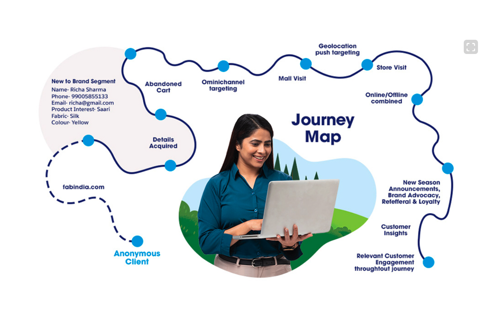

# Professional Journey Map Generator

Transform your resume into a beautiful **visual journey map** with smooth curved paths and professional touchpoints - just like real customer journey maps!



## What You Get

✅ **Smooth curved paths** connecting career milestones (NOT ASCII boxes!)
✅ **Professional touchpoint dots** at each position
✅ **Clean labels** showing year, duration, role, and company
✅ **Production-ready output** in HTML and SVG formats
✅ **Interactive hover effects** on the HTML version

## Quick Start

### Web UI (Easiest Way)

1. **Install Flask:**
   ```bash
   pip install Flask Werkzeug
   ```

2. **Start the server:**
   ```bash
   python3 web_app.py
   ```

3. **Open in browser:**
   ```
   http://localhost:5000
   ```

4. **Upload your resume** (TXT format) or click "Try Demo"

### Command Line

```bash
# Generate journey map from your resume
python3 professional_journey_map.py chetan_resume.txt

# This creates:
# - journey_map.html (interactive - open in browser)
# - journey_map.svg (vector graphic)
```

### Custom Output

```bash
# SVG only
python3 professional_journey_map.py resume.txt --svg output.svg

# HTML only
python3 professional_journey_map.py resume.txt --html output.html
```

## Resume Format Required

Your resume must have career entries like this:

```
Client: Company Name (SAS) - Oct 2023 to Current
Role: Senior Technical Architect
Company: Coforge
Responsibilities: Working on Sending Digital CRM campaigns...

Client: Company Name (SAS) - Aug 2020 to Oct 2023
Role: Senior Architect and Senior Developer
Company: Coforge
Responsibilities: Designed and Built Platform for Flight Disruption Management...
```

**Format Pattern:**
```
Client: [Company] - [Month YYYY] to [Current|Month YYYY]
Role: [Your Role]
Company: [Employer]
Responsibilities: [What you did]
```

## Example Output

For Chetan's 14-year career, the journey map shows:

```
2011 (3.9y) → Software Developer @ Southwest Airlines (HCL)
2015 (3.2y) → Senior Developer @ IAG (Email/SMS) (Coforge)
2018 (2.4y) → Senior Developer @ IAG (Claims) (Coforge)
2020 (3.2y) → Senior Architect @ SAS (Platform) (Coforge)
2023 (2.1y) → Senior Technical Architect @ SAS (CRM) (Coforge)
```

All connected by a **smooth S-curve with touchpoint dots**!

## Files in This Repo

### Main Files
- `professional_journey_map.py` - **Visual journey map generator** (NEW!)
- `web_app.py` - Flask web interface (updated to use visual maps)
- `chetan_resume.txt` - Example resume (14 years career)

### Generated Examples
- `journey_map.html` - Interactive journey map (open in browser)
- `journey_map.svg` - Vector graphic version
- `image.png` - Reference image (customer journey map style)

### Old Files (Deprecated)
- `resume_journey_map_enhanced.py` - Old ASCII box generator (don't use)
- `resume_journey_map.py` - Original version (don't use)

## What's Different Now?

| Old (ASCII Boxes) | New (Visual Map) |
|-------------------|------------------|
| ╭──[ 2023 ]──╮ | Smooth bezier curve |
| │ Text boxes │ | Touchpoint dots ● |
| Text-based | SVG/HTML graphics |
| Terminal only | Web browser |

## How It Works

1. **Parse Resume** - Extracts career entries with dates
2. **Generate Path Points** - Creates S-curve coordinates
3. **Draw Smooth Curves** - Uses cubic bezier for connections
4. **Add Touchpoints** - Places dots at each milestone
5. **Position Labels** - Alternates labels left/right
6. **Export** - Saves as interactive HTML or SVG

## Viewing the Output

### HTML File (Recommended)
```bash
# Linux
xdg-open journey_map.html

# macOS
open journey_map.html

# Windows
start journey_map.html

# Or just double-click the file
```

### SVG File
Open in any browser or vector graphics app (Inkscape, Illustrator, etc.)

## Troubleshooting

**Q: Flask not installed?**
```bash
pip install Flask Werkzeug
```

**Q: No milestones found?**
Check your resume format matches the pattern above:
- Must have "Client:", "Role:", "Company:", "Responsibilities:"
- Dates must be "Month YYYY to Current" or "Month YYYY to Month YYYY"

**Q: Where are the files?**
In the same directory where you ran the command.

**Q: Can I use PDF/DOCX?**
Not yet - currently only TXT format is supported. Convert your resume to plain text first.

## Web Interface Features

- 🎯 Upload resume (drag & drop)
- 🗺️ Generate visual journey map
- 📊 See milestone list
- 💾 Download HTML or SVG
- 🎨 Interactive touchpoints with hover effects

## Technical Details

- **Path Algorithm**: S-curve using sine wave for horizontal oscillation
- **Curves**: Cubic bezier curves with 40/60 control points
- **Touchpoints**: 12px radius circles with 8px inner highlight
- **Colors**: Professional blue (#2563eb)
- **Font**: Inter from Google Fonts
- **Dimensions**: 1400x800px (customizable)

## Example Career Map

Chetan's journey map shows:
- **14 years** of experience (2011-2025)
- **5 major positions** across 3 companies
- **2 airlines** (Southwest, IAG, SAS)
- **3 years average** tenure per role
- **Clear progression** from Developer to Architect

All visualized as a flowing journey path!

## Credits

Built to create professional visual career journey maps inspired by customer journey mapping techniques used in UX/business.

---

**Need help?** Check that your resume follows the format above, or use `chetan_resume.txt` as a template.
